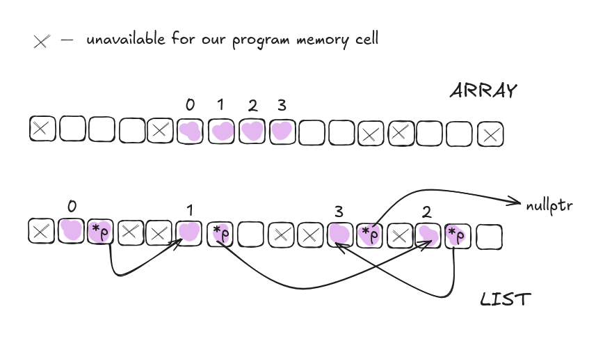

My uni task: linked list(stack) implementation

I loved this one, it was really interesting to do. Try it if you heard of pointers

## Implemented operations with list:
void add_el(int el_val)  
void insert(int el_val, int index) not replace, add new one  
void rem(int index)  
void replace_val(int old_val, int new_val) replace (match by value)  
bool is_empty()  
int top_i() get first(?) element  
void pop() remove first(?) element of list / pop stack  
void view() print all elements  
void clear() the whole list  

## How array vs list works
#### (idk, that's how i understand it. i'm noob, keep in mind when taking it as truth)

### array
When an array is created, the system searches for a contiguous block of memory that can fit all its elements. This is why you need to define the array size beforehand— so the compiler can allocate enough space in one continuous block. 

### list
list doesnt need a sequence of free memory for its whole length. Instead, each element(node) is allocated separately. List element is a struct of value and adress(pointer) to the next element of list. nullptr is used to indicate the end of the list.

